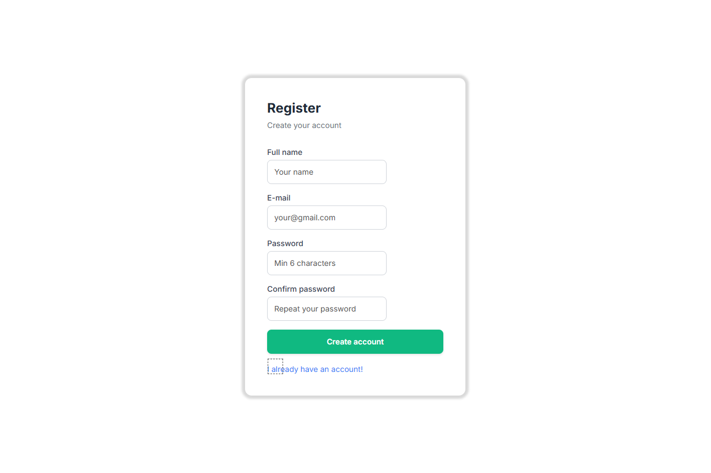
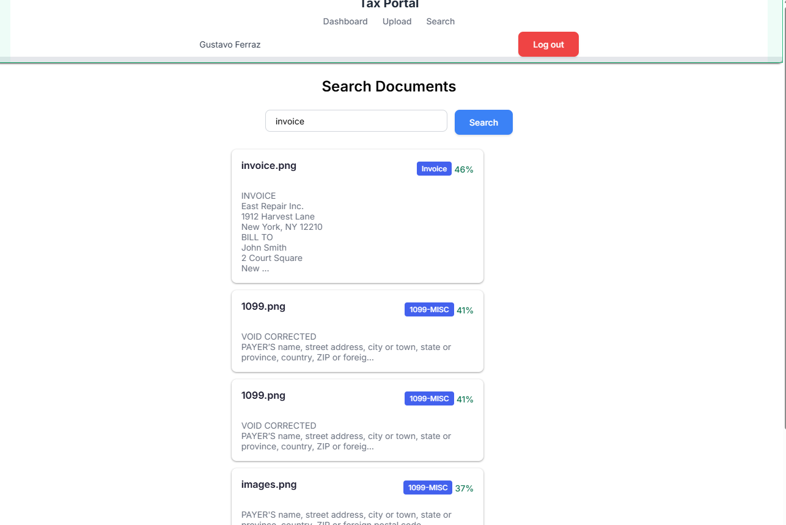
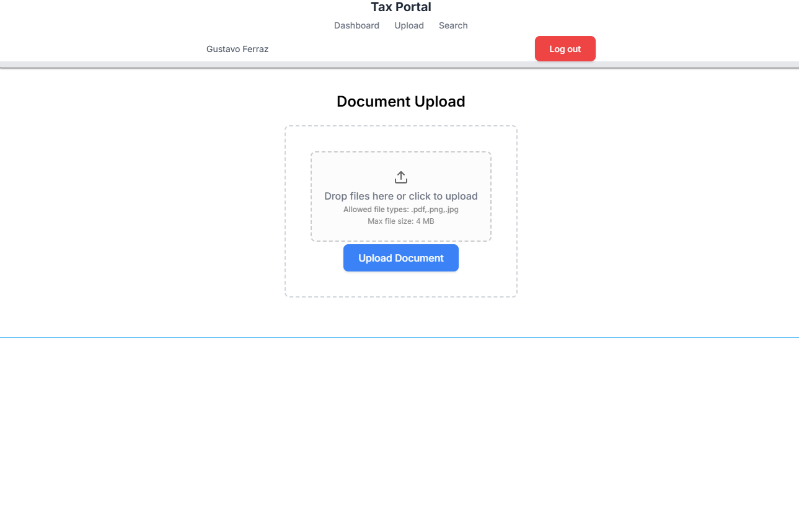
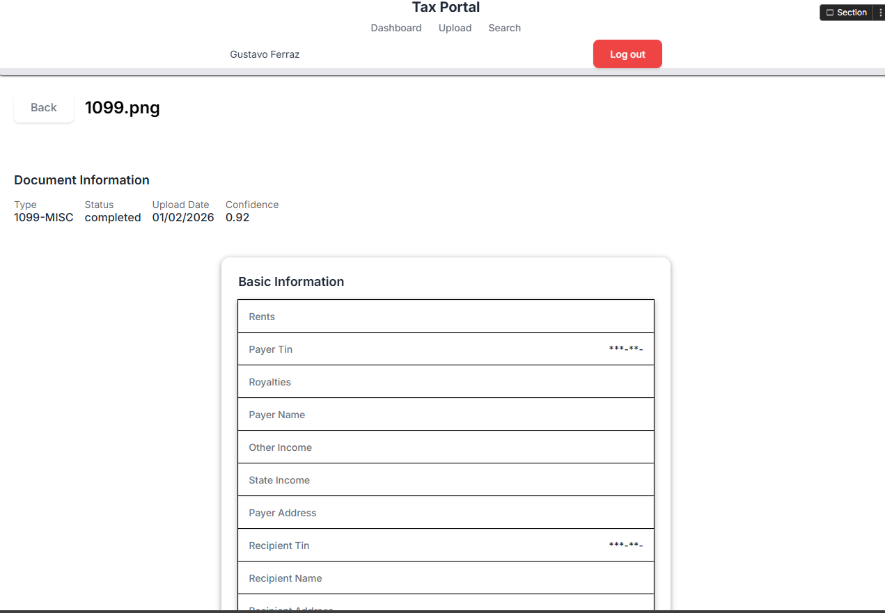

# Part 5: WeWeb Client Portal Integration

## Live Demo

**Portal URL:** https://c13915f5-e1e8-42de-89a2-a7fc500781d1.weweb-preview.io/register

### Test Credentials
You can create a new account using the registration page, or contact us for demo credentials.

> **Note:** Project export is a paid WeWeb feature. Screenshots and documentation are provided as an alternative to demonstrate the implementation.

---

## Overview

The Tax Portal is a fully functional client-facing web application built with WeWeb, providing an intuitive interface for clients to interact with the tax document processing system. The portal integrates seamlessly with the Supabase backend for authentication and the Node.js API for document processing.

## Portal Pages

### 1. Registration Page (`/register`)



A clean, user-friendly registration form that allows new clients to create accounts.

**Features:**
- Full name input field
- Email validation
- Password with minimum 6 characters requirement
- Password confirmation
- "Create account" button with Supabase integration
- Link to login page for existing users

**Technical Implementation:**
- Connected to Supabase Auth for user registration
- Form validation before submission
- Automatic redirect to login on success
- Error handling for duplicate emails

---

### 2. Search Documents Page (`/search`)



Semantic search powered by RAG (Retrieval Augmented Generation) using OpenAI embeddings.

**Features:**
- Natural language search input
- Real-time search results
- Document type badges (Invoice, 1099-MISC, W-2, etc.)
- Similarity percentage display (e.g., 46%, 41%, 37%)
- OCR text preview for each result
- Click to view full document details

**Technical Implementation:**
- Calls `POST /api/v1/search` endpoint
- Query embedding generated via OpenAI
- pgvector similarity search in Supabase
- Results sorted by relevance score

**Example Search Results:**
| Document | Type | Similarity |
|----------|------|------------|
| invoice.png | Invoice | 46% |
| 1099.png | 1099-MISC | 41% |
| images.png | 1099-MISC | 37% |

---

### 3. Document Upload Page (`/upload`)



Drag-and-drop file upload interface for submitting tax documents.

**Features:**
- Drag and drop zone with visual feedback
- Click to browse files
- Supported formats: PDF, PNG, JPG
- Maximum file size: 4 MB
- "Upload Document" button
- Progress indicator during upload

**Technical Implementation:**
- File converted to base64 on client
- Calls `POST /api/v1/upload/base64` endpoint
- Automatic MIME type detection
- Document queued for N8N processing
- Redirect to dashboard on success

---

### 4. Document Details Page (`/documents/:id`)



Detailed view of processed documents with extracted data.

**Features:**
- Back navigation button
- Document filename display
- Document Information section:
  - Type (e.g., 1099-MISC)
  - Status (completed, processing, failed)
  - Upload Date
  - OCR Confidence score (e.g., 0.92)
- Basic Information section with extracted fields:
  - Rents
  - Payer TIN (masked: ***-**-)
  - Royalties
  - Payer Name
  - Other Income
  - State Income
  - Payer Address
  - Recipient TIN (masked: ***-**-)
  - Recipient Name
  - And more...

**Technical Implementation:**
- Fetches document via `GET /api/v1/documents/:id`
- Dynamic field rendering based on document type
- Sensitive data (TINs, SSNs) automatically masked
- Reprocess button triggers `POST /api/v1/documents/:id/reprocess`

---

## Navigation & Layout

### Header Component

The portal features a consistent header across all authenticated pages:

```
┌─────────────────────────────────────────────────────────────────┐
│  Tax Portal     Dashboard    Upload    Search      [Log out]    │
│                                                                 │
│  User Name                                                      │
└─────────────────────────────────────────────────────────────────┘
```

**Elements:**
- **Tax Portal**: Brand name/logo
- **Dashboard**: Link to main dashboard
- **Upload**: Link to file upload page
- **Search**: Link to semantic search
- **User Name**: Displays logged-in user
- **Log out**: Red button to end session

---

## Authentication Flow

```
┌─────────────┐     ┌─────────────┐     ┌─────────────┐
│  Register   │───▶│   Login     │────▶│  Dashboard │
│   Page      │     │   Page      │     │   (Auth)    │
└─────────────┘     └─────────────┘     └─────────────┘
                           │
                           │ Supabase Auth
                           ▼
                    ┌─────────────┐
                    │   Session   │
                    │   Token     │
                    └─────────────┘
```

1. User registers or logs in via Supabase Auth
2. JWT token stored in session
3. Token passed to API calls via Authorization header
4. Protected routes check for valid session
5. Logout clears session and redirects to login

---

## API Integration

### Collections Configured

| Collection | Endpoint | Method | Auto-fetch |
|------------|----------|--------|------------|
| documents | /documents | GET | On page load |
| stats | /stats | GET | On dashboard |
| searchResults | /search | POST | On search |

### Workflows Implemented

1. **Registration Workflow**
   - Supabase Sign Up action
   - Redirect to login on success

2. **Login Workflow**
   - Supabase Sign In action
   - Redirect to dashboard on success

3. **Upload Workflow**
   - Convert file to base64
   - POST to /upload/base64
   - Show success notification

4. **Search Workflow**
   - POST query to /search
   - Update results variable
   - Display in repeater

---

## Technical Stack

| Component | Technology |
|-----------|------------|
| Frontend | WeWeb (No-code) |
| Authentication | Supabase Auth |
| Database | Supabase PostgreSQL |
| API | Node.js/Express (Vercel) |
| Search | pgvector + OpenAI Embeddings |
| Processing | N8N Workflows |

---

## Design Features

- **Clean UI**: Minimal, professional design
- **Responsive**: Works on desktop and mobile
- **Color Scheme**:
  - Primary: Blue (#4A90D9)
  - Danger: Red (#E74C3C)
  - Success: Green (#27AE60)
- **Typography**: Clear, readable fonts
- **Status Badges**: Color-coded document types

---

## Files Included

| File | Description |
|------|-------------|
| README.md | This documentation |
| 1.png | Registration page screenshot |
| 2.png | Search page screenshot |
| 3.png | Upload page screenshot |
| 4.png | Document details screenshot |
| weweb-guide.md | Detailed setup guide |
| integration-checklist.md | Implementation checklist |

---

## Limitations & Notes

1. **Project Export**: WeWeb project export requires a paid subscription. Screenshots and documentation are provided as alternative proof of implementation.

2. **Preview URL**: The portal is accessible via WeWeb's preview mode at the URL provided above.

3. **Test Data**: The portal connects to a live Supabase instance with test documents already processed.

---

## How to Test

1. Visit: https://c13915f5-e1e8-42de-89a2-a7fc500781d1.weweb-preview.io/register/

2. Create a new account with your email

3. Explore the portal:
   - **Dashboard**: View processing statistics
   - **Upload**: Upload a test document (PDF, PNG, or JPG)
   - **Search**: Try searching for "invoice" or "1099"
   - **Document Details**: Click any search result to see extracted data

4. Test the semantic search with queries like:
   - "invoice"
   - "tax form"
   - "W-2 wages"
   - "1099 income"
